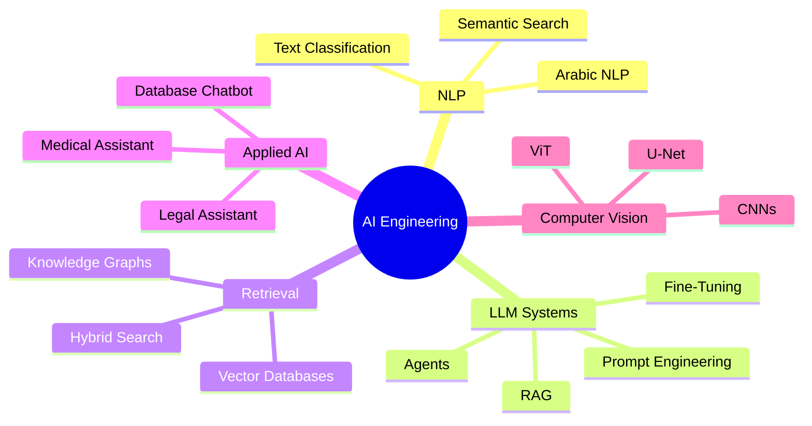
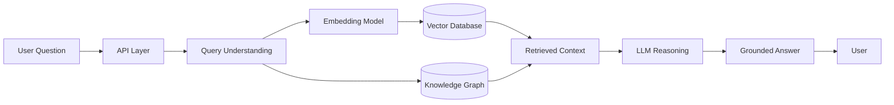

<!--
✨ Advanced GitHub Profile README
Replace every YOUR_GITHUB_USERNAME with your real GitHub username.
-->

 

  

---

##  About Me

I build intelligent AI systems that combine **LLMs, NLP, RAG, vector databases, semantic search, and production-ready APIs**.

My main focus is creating real-world AI solutions for:

- Arabic NLP systems
- Retrieval-Augmented Generation pipelines
- Agentic AI workflows
- Medical and Legal AI assistants
- Semantic search engines
- LLM-based database chatbots

 

---

## 🧠 AI Focus Map

---

## 🚀 AI Focus Areas

---

## 🛠️ Tech Stack

### 💻 Languages & Databases

### 🤖 AI / ML / Deep Learning

  

### 🧩 LLM Engineering

### 🗂️ Vector Databases & Retrieval

### ⚙️ Deployment & MLOps

  

---

## 🔥 Featured AI Projects

<table>
<tr>
<td width="50%">

<h3 align="center">🩺 Arabic Medical GraphRAG</h3>

Arabic medical RAG system combining **Knowledge Graphs + Vector Search** to improve answer grounding and reduce hallucinations.

**Tech:** Neo4j, Qdrant, FastAPI, Gemini, Cohere, Docker

**Highlights:**
- Hybrid retrieval pipeline
- Arabic medical question answering
- Semantic caching
- Production-ready backend

</td>
<td width="50%">

<h3 align="center">🧾 Dynamic Database Chatbot</h3>

AI chatbot that converts natural language questions into executable SQL queries.

**Tech:** OpenAI, SQL Server, pyodbc, Embeddings

**Highlights:**
- Natural language to SQL
- Semantic schema search
- Intent-to-table mapping
- Business-friendly database access

</td>
</tr>

<tr>
<td width="50%">

<h3 align="center">📚 Hadith Books RAG Search</h3>

Semantic search system for Hadith books using Retrieval-Augmented Generation.

**Tech:** Pinecone, Qwen, Embeddings, RAG

**Highlights:**
- Hadith content indexing
- Semantic retrieval
- LLM summaries
- Context-aware answers

</td>
<td width="50%">

<h3 align="center">⚖️ Legal AI Assistant</h3>

Arabic legal QA assistant over PDF documents with OCR fallback.

**Tech:** OCR, PDF Parsing, RAG, Semantic Search, APIs

**Highlights:**
- Handles scanned PDFs
- Arabic legal question answering
- Source-grounded responses
- Noisy document processing

</td>
</tr>
</table>

---

## 🧭 AI System Architecture

---

## 💼 Experience

### NLP Engineer Intern — Dexef  
**Oct 2024 – Apr 2025**

- Built LLM-based applications using LangChain and RAG.
- Designed semantic search pipelines with improved retrieval quality.
- Fine-tuned Transformer models for NLP tasks.

### AI Advanced Mentor — Instant  
**Nov 2025 – Present**

- Mentoring learners in advanced AI and Machine Learning.
- Guiding hands-on AI projects.
- Supporting students in building real-world AI systems.

### AI Head — Developer Student Club  
**Oct 2025 – Mar 2026**

- Led the AI team and mentored junior members.
- Delivered AI and ML training sessions.
- Organized workshops and supervised student projects.

---

## 🎓 Education

**Bachelor of Computer Science**  
Faculty of Computer Science, El Shorouk Academy — Cairo, Egypt  
**Oct 2022 – Jun 2026**

---

## 📜 Certificates

---

## 📊 GitHub Analytics

  

  

---

## 🏆 GitHub Trophies

---

## 🐍 Contribution Snake

> To make the snake animation work, add a GitHub Action that generates the snake SVG into the `output` branch.

---

## 📫 Contact

 

<h3>Building AI systems that connect data, language, and real-world decisions.</h3>

